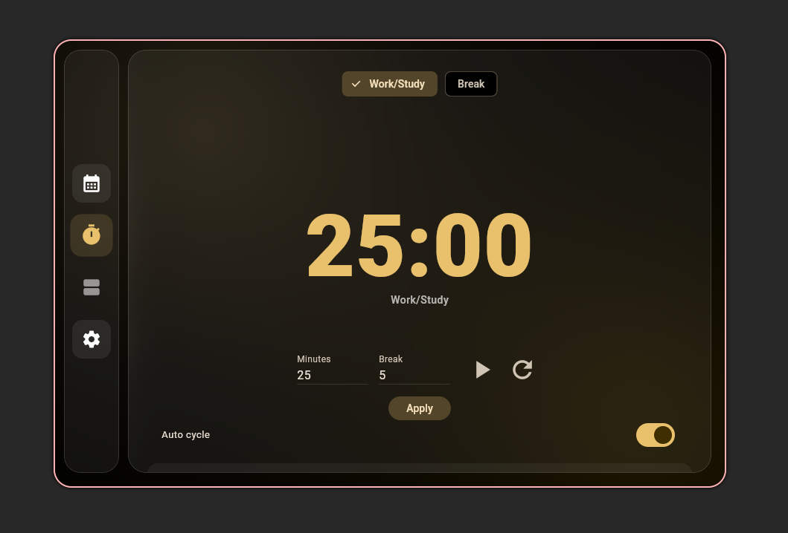
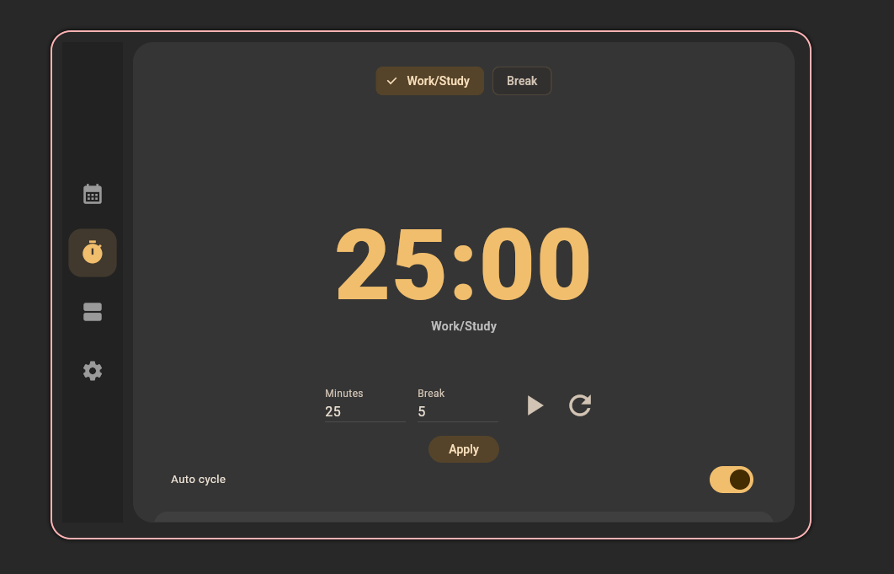
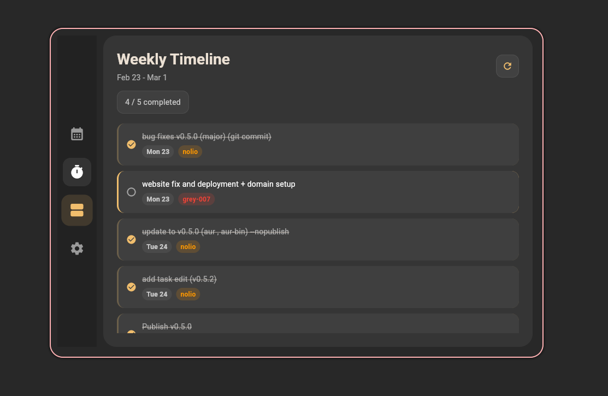
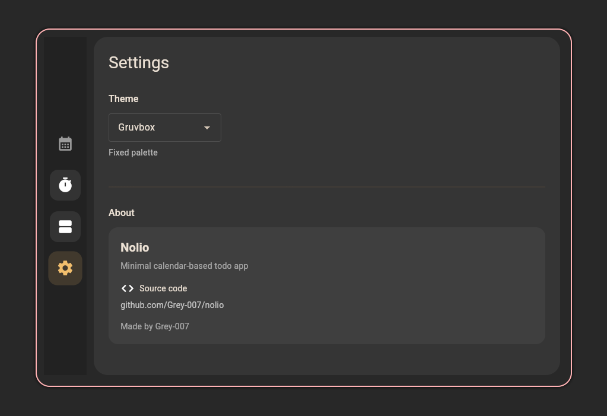
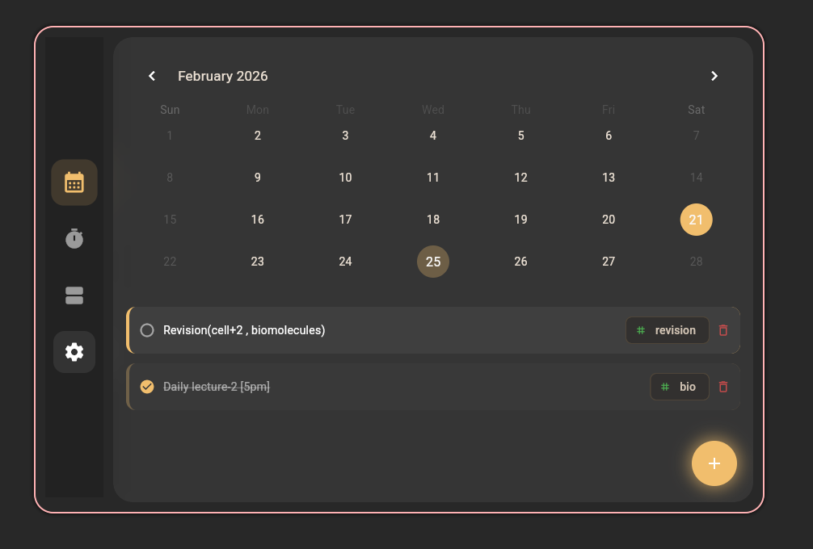
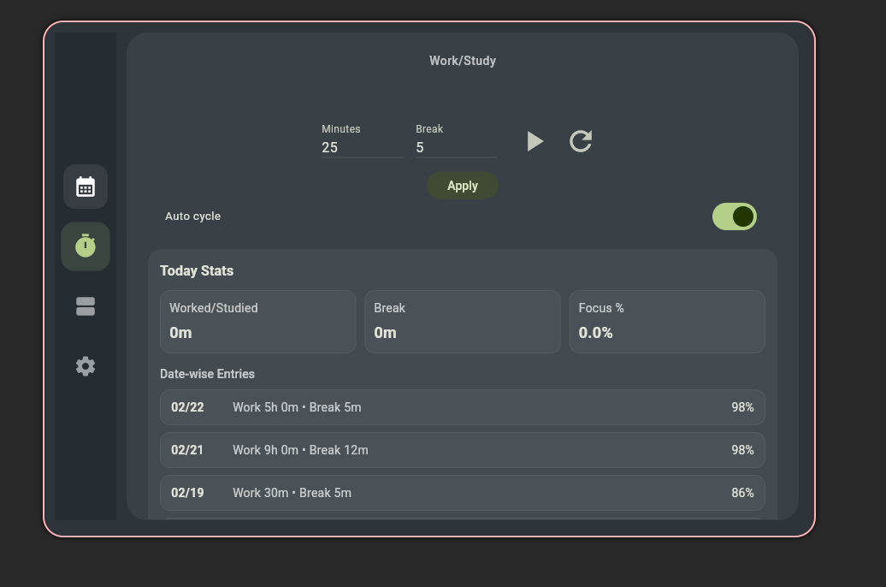

<div align="center">

<div style="display:inline-block; text-align:left; padding:20px 28px; border:1px solid #2a2a2a; border-radius:10px;">

  <div style="display:flex; align-items:center; gap:16px;">
    
    <h1 style="margin:0;">Nolio</h1>
  </div>

  <p style="margin:10px 0 0 64px; color:#cfcfcf;">
    A calm, calendar-first todo app for Linux.<br/>
    Built with Flutter. Designed for focus.
  </p>

</div>

</div>

<p align="center">
  <a href="https://aur.archlinux.org/packages/nolio">
    
  </a>
  <a href="https://aur.archlinux.org/packages/nolio-bin">
    
  </a>
  <a href="https://github.com/Grey-007/nolio/releases">
    
  </a>
  <a href="LICENSE">
    
  </a>
  
  
  
</p>

---

## 🧠 Philosophy

Most productivity apps overwhelm you with features.

Nolio does the opposite.

- Your **day** is the interface  
- Tasks live directly inside the **calendar**
- No dashboards  
- No nested project systems  
- No subscription  
- No tracking  

Just a clean, distraction-free planning surface built specifically for Linux desktop users.

---

## ✨ Features

- 📅 Calendar-centric task management
- 🧩 Click a date → add tasks instantly
- 🎨 Clean, minimal UI with consistent spacing
- ⌨️ Keyboard & mouse friendly workflow
- 🐧 Native Linux desktop app
- 🖥️ Works on Wayland & X11
- 💾 Local storage (SQLite)

---

## 📸 Screenshots

| | | |
|---|---|---|
|  |  |  |
|  |  |  |
|  |  |  |

---

## 📦 Installation (Arch Linux)

### 🔹 Recommended — Prebuilt Binary

Fastest install. No Flutter required.

```bash
yay -S nolio-bin
````

### 🔹 Build from Source

Build locally using Flutter.

```bash
yay -S nolio
```

---

## 🚀 Usage

Launch from terminal:

```bash
nolio
```

Or open it from your application launcher (Rofi, GNOME, KDE, etc.).

---

## 🛠️ Built With

* Flutter (Linux Desktop)
* Dart
* GTK-based Linux runtime
* SQLite (local persistence)

---

## 🧩 Development

Clone the repository:

```bash
git clone https://github.com/Grey-007/nolio.git
cd nolio
```

Run in development mode:

```bash
flutter pub get
flutter run -d linux
```

Build release binary:

```bash
flutter build linux --release
```

---

## 🛣️ Roadmap

Planned improvements:

* [ ] Recurring tasks
* [ ] Faster keyboard quick-add
* [ ] Backup / export support
* [ ] Performance refinements

---

## 🤝 Contributing

Contributions, bug reports, and UI feedback are welcome.

* Open an issue for bugs or suggestions
* Keep pull requests focused and clean
* Follow existing UI spacing principles
* UI/UX feedback is especially appreciated

---

## 📄 License

MIT License
See [`LICENSE`](LICENSE) for details.

---

## ❤️ Credits

Built and maintained by **Grey-007**.

